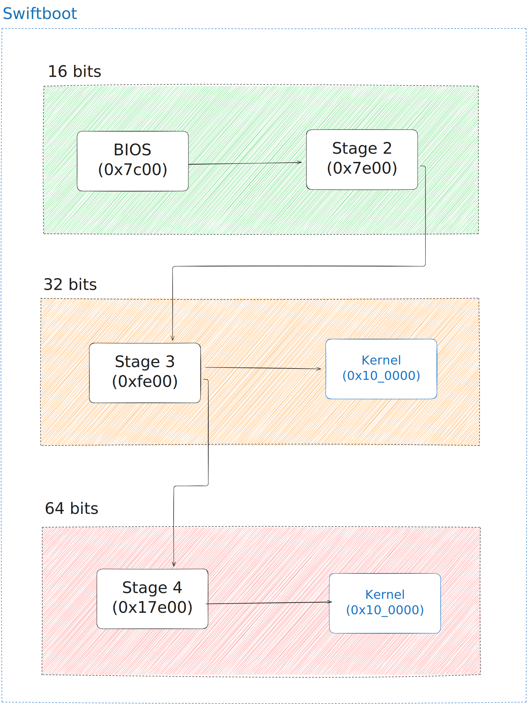

<div align="center">
  <br>
  

# Swiftboot

**Three-stage x86 bootloader written in Rust**

[](https://www.rust-lang.org/)
[](LICENSE)
[](https://docs.rust-embedded.org/book/)
</div>

<br>

## Quick Start
```bash
# Clone and build
git clone https://github.com/Hoteira/swiftboot.git
cd swiftboot

# Install nightly and components
rustup toolchain install nightly
rustup component add rust-src llvm-tools-preview
cargo install cargo-binutils

# Build bootloader
cargo compile

# Attach your kernel (replace with your kernel path)
dd if=path/to/your/kernel.bin of=build/disk.img bs=512 seek=5120 conv=notrunc

# Run
qemu-system-x86_64 -drive file=build/disk.img,format=raw -m 1G -serial stdio
```

## Features

- **Three-Stage Boot** — Modular 512B → 16KB → 16KB → Kernel (32-bits)
- **Four-Stage Boot** — Modular 512B → 16KB → 16KB → 16KB → Kernel (64-bits)
- **Hardware Setup** — Configures GDT, TSS, memory map (E820), RSDP and VBE/VGA graphics
- **Disk I/O** — BIOS interrupts (16-bit) and ATA PIO (32/64-bit)
- **Pure Rust** — Minimal assembly, custom target specs for 16/32/64-bit

## Architecture
```

**Disk Layout:**
- LBA 0: Stage 1 (MBR)
- LBA 2048: Stage 2
- LBA 3072: Stage 3
- LBA 5120: Stage 4
- LBA 6144: Your Kernel

**Boot Info Passed to Kernel:**
```rust
struct BootInfo {
    mmap: MemoryMap,        // E820 memory map
    rsdp: Rsdp,             // ACPI table
    tss: u16,               // TSS selector
    vbe: VbeInfoBlock,      // VBE info
    mode: VbeModeInfoBlock, // Graphics mode
}

#[unsafe(no_mangle)]
extern "C" fn _start(bootinfo_ptr: *const BootInfo) { ... }
```

## Boot Stage Pipeline

The boot process is divided into four distinct stages, utilizing custom target specifications (`bits16`, `bits32`, `bits64`) to ensure correct code generation.

<div align="center">
  
</div>
<br>

## Custom Build System

The `cargo-compile` tool orchestrates the build:
```bash
cargo compile  # Builds all stages, converts to raw binaries, assembles disk.img
```

Uses custom target specs:
- `bits16.json` — 16-bit real mode (Stage 1, 2)
- `bits32.json` — 32-bit protected mode (Stage 3)
- `bits64.json` — 64-bit long mode (Stage 4)

All stages have constants pointing to the next stage (both in the disk and in the RAM)
Stage 2 also defines the parameters for the display mode that will be chosen (feel free to customize them to your liking):

```rust
const MAX_BPP: u8 = 32;
const MIN_BPP: u8 = 24;

const MAX_WIDTH: u16 = 1024;
const MIN_WIDTH: u16 = 0;
const MAX_HEIGHT: u16 = 800;
const MIN_HEIGHT: u16 = 0;

const MODE: u16 = 0x1; // 0 => VGA, 1 => VBE
```

Stage 3 defines the mode to boot into and the stack
```rust
const BOOT_MODE: u8 = 64; //32 or 64 bits
const STACK_ADDRESS: u64 = 0x30_0000;
```

## Future Features

- [x] 64-bit mode
- [ ] Multiboot2 compliant

## License

Licensed under the [MIT License](LICENSE).

